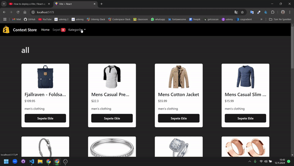
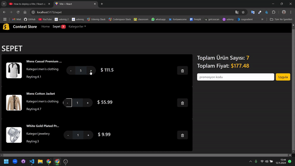
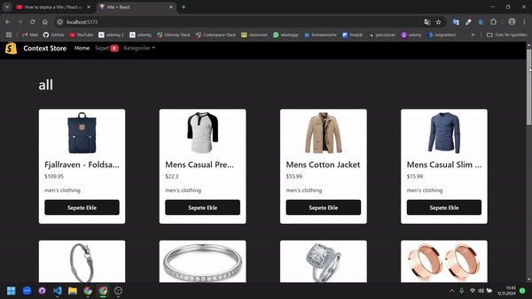
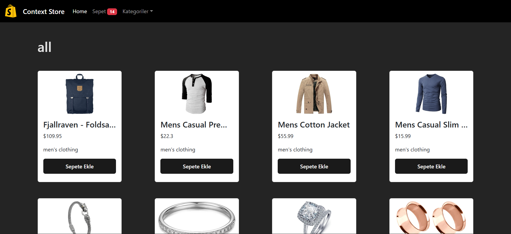
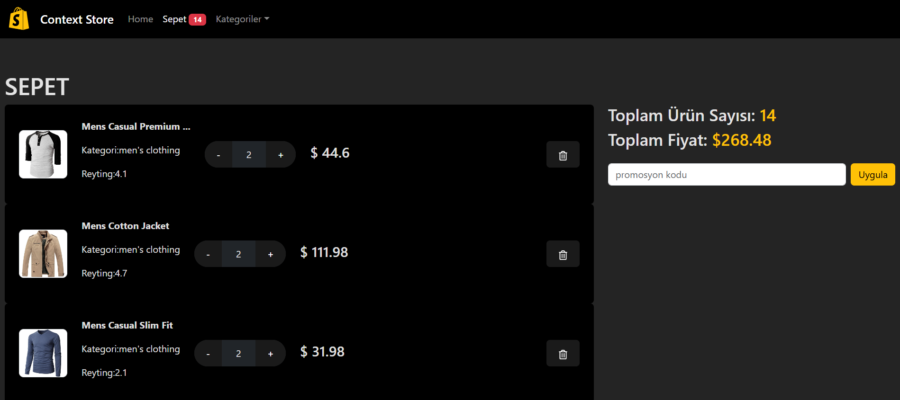

# STORE

 

  

  

Bu proje, React ile geliştirdiğim bir e-ticaret mağazası uygulamasıdır. Site içerisinde toplam 2 ana sayfa bulunmaktadır: **Home** , ve **Sepet** . Sayfalar arası geçişlerde **React Router** kullanılmıştır.

  

  

  

## Özellikler

- **Responsive Tasarım**: Tüm sayfalar, farklı ekran boyutlarına uyumlu olacak şekilde tasarlanmıştır.
- **React Router**: Sayfalar arasında hızlı ve akıcı geçişler için kullanılmıştır.
- **Ürün Ekleme ve Çıkarma**: Kullanıcılar ürünleri sepete ekleyebilir, çıkarabilir ve sepetten güncelleyebilir.
- **Pop-up Bildirimler**: Ürün ekleme, çıkarma gibi işlemler için sağ üstte pop-up bilgilendirmeleri.
- **Ürün Kategorileri**: Ürünler kategoriye göre filtrelenebilir.
- **Navbar Ürün Sayacı**: Sepetinizdeki ürün sayısını navbar’da görebilirsiniz.
  

  

## Kullanılan Teknolojiler

- **React**: Arayüz bileşenleri oluşturmak için.
- **React Router**: Sayfa geçişleri sağlamak için.
- **CSS**: Tasarım ve düzenlemeler için.

  
    
  

 
 

  

 

  <a href="/" style="font-size: 20px; color: #FFC107;">Web sitesine şu an erişilemiyor.</a>

 
 

## Renk Paleti

  

  

  

